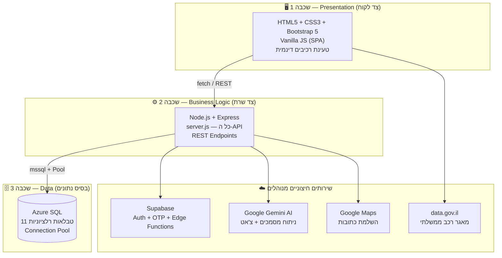
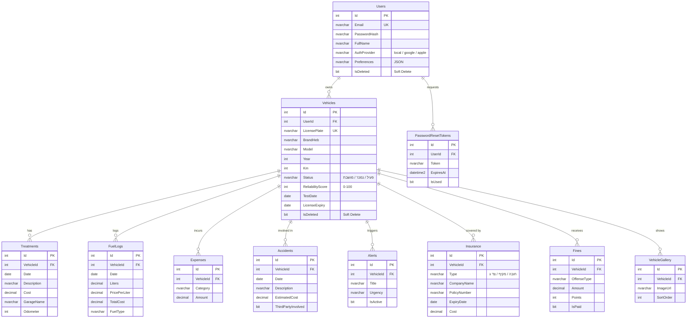

<div align="center">

# 🚗 EasyCare

### מערכת חכמה לניהול ותחזוקת רכבים מבוססת בינה מלאכותית


**פרויקט גמר** &middot; מיכאל גיישס & רזיאל ביטון

*כל היסטוריית הרכב שלך — טיפולים, ביטוחים, דלק, דוחות ותאונות — במקום אחד, חכם ואוטומטי.*

</div>

---

## 📑 תוכן עניינים

- [⚠️ חשוב לפני שמתחילים — התחלה קרה (Cold Start)](#-חשוב-לפני-שמתחילים--התחלה-קרה-cold-start)
- [על הפרויקט](#-על-הפרויקט)
- [יכולות מרכזיות](#-יכולות-מרכזיות)
- [ארכיטקטורת המערכת](#-ארכיטקטורת-המערכת)
- [מבנה בסיס הנתונים (ERD)](#-מבנה-בסיס-הנתונים-erd)
- [טכנולוגיות](#-טכנולוגיות)
- [מדריך שימוש מלא](#-מדריך-שימוש-מלא)
- [התקנה והרצה מקומית](#-התקנה-והרצה-מקומית)
- [משתני סביבה](#-משתני-סביבה)
- [תיעוד API](#-תיעוד-api)
- [אלגוריתמים ולוגיקה חכמה](#-אלגוריתמים-ולוגיקה-חכמה)
- [מבנה הפרויקט](#-מבנה-הפרויקט)
- [אבטחה](#-אבטחה)
- [פתרון תקלות נפוצות (FAQ)](#-פתרון-תקלות-נפוצות-faq)
- [קרדיטים](#-קרדיטים)

---

## ⚠️ חשוב לפני שמתחילים — התחלה קרה (Cold Start)

> [!IMPORTANT]
> הפרויקט רץ על **מסלולים חינמיים** של Render ו-Azure לצורכי הדגמה. המשמעות המעשית:

| רכיב | התנהגות | זמן המתנה | מה לעשות |
|---|---|---|---|
| 🖥️ **שרת Render** | נכבה אוטומטית אחרי ~15 דקות ללא פעילות | עד **50 שניות** בגישה הראשונה | פשוט להמתין — העמוד ייטען לבד |
| 🗄️ **Azure SQL** | מסד הנתונים עובר למצב **Paused** בחוסר פעילות | **עד דקה וחצי** בהתחברות הראשונה | אם לחיצה על "התחברות" לא מגיבה — להמתין ~60-90 שניות **וללחוץ שוב** |

**בקיצור:** הכניסה הראשונה למערכת אחרי זמן ללא שימוש עשויה להרגיש "תקועה". זה לא באג — המערכת שולחת פקודת התעוררות לשרת ול-DB. לאחר ההתעוררות, המערכת עובדת מהר וחלק לחלוטין. ✅

---

## 🎯 על הפרויקט

### הבעיה

ניהול רכב פרטי בישראל דורש מעקב אחרי עשרות דברים במקביל: טיפולים תקופתיים, חידוש ביטוח חובה ומקיף, מועד הטסט הבא, אגרות רישוי, הוצאות דלק, דוחות תנועה ותיעוד תאונות. בפועל, רוב בעלי הרכב מנהלים את זה בקלסרים, בפתקים, או בזיכרון — מה שמוביל לקנסות על איחורים, לאובדן חשבוניות, ולירידת ערך משמעותית במכירה בגלל חוסר תיעוד.

### הפתרון

**EasyCare** מרכזת את *כל* המידע על הרכב במקום אחד (Single Source of Truth), ומוסיפה שכבת בינה מלאכותית שעושה את העבודה השחורה בשבילך:

- 📸 מצלמים פוליסת ביטוח → ה-AI ממלא את כל הטופס לבד
- 🔍 מקלידים מספר רכב → כל הנתונים נשלפים אוטומטית ממשרד התחבורה
- 🧑‍🔧 שואלים שאלה על הרכב → צ'אטבוט "מוסכניק וירטואלי" שמכיר את ההיסטוריה המלאה שלו עונה
- 💰 רוצים למכור? → דוח מכירה ציבורי מקצועי עם QR להדפסה נוצר בלחיצה

### קהל היעד

בעלי רכבים פרטיים, משפחות וארגונים קטנים עם מספר רכבים, ומוכרי רכבים שרוצים להציג שקיפות מלאה לקונים.

---

## ✨ יכולות מרכזיות

| יכולת | תיאור | טכנולוגיה |
|---|---|---|
| 🤖 **סריקת פוליסה ב-AI** | העלאת PDF/תמונה של פוליסת ביטוח — חילוץ אוטומטי של כל השדות לטופס | Gemini 2.5 Flash (OCR + JSON) |
| 🧑‍🔧 **מוסכניק וירטואלי** | צ'אטבוט שמכיר את ההיסטוריה המלאה של הרכב הספציפי שלך | Gemini + RAG |
| 🚘 **שליפה ממשרד התחבורה** | הקלדת מספר רכב מביאה את כל הנתונים הרשמיים כולל תו נכה | data.gov.il API |
| ⛽ **מחירי דלק Live** | ווידג'ט עם מחיר הדלק הרשמי העדכני | Gemini + Cache חכם (6 שעות) |
| 📊 **דשבורד פיננסי** | גרפים של הוצאות לפי חודש/שנה/קטגוריה + תובנות AI | Chart.js |
| 🏆 **ציון אמינות רכב** | אלגוריתם משוקלל (0-100) שמדרג כמה הרכב מתוחזק ומתועד | Weighted Scoring |
| 📄 **דוח מכירה ציבורי** | עמוד אינטרנט ייעודי לרכב עם גלריה, היסטוריה ו-QR להדפסה | Public Report + QR |
| 🔔 **התראות חכמות** | תזכורות לטסט, ביטוח וטיפולים לפי רמת דחיפות | Alerts Engine |
| 💾 **שמירה אוטומטית** | טפסים נשמרים תוך כדי הקלדה — שום מידע לא הולך לאיבוד | Auto-Save Drafts |
| 🔐 **התחברות מאובטחת** | הרשמה רגילה, Google, Apple + איפוס סיסמה עם OTP למייל | Supabase Auth |

---

## 🏛️ ארכיטקטורת המערכת

המערכת בנויה בארכיטקטורת **3-Tier Monolith** ("Majestic Monolith") — שלוש שכבות ברורות עם הפרדת אחריות מלאה, בשילוב שירותים חיצוניים מנוהלים (Managed Services):



**למה מונוליט ולא Microservices?** לצוות של 2 מפתחים, מונוליט מסודר נותן פיתוח מהיר יותר, דיבוג פשוט יותר, ופריסה בפקודה אחת — בלי המורכבות התפעולית של תיאום בין שירותים. ההפרדה הפנימית לשכבות שומרת על ניקיון הקוד ומאפשרת מעבר עתידי לשירותים נפרדים אם המערכת תגדל.

**זרימת CI/CD:** כל `git push` ל-GitHub מפעיל אוטומטית פריסה מחודשת ב-Render. אפס תצורה ידנית.

---

## 🗄️ מבנה בסיס הנתונים (ERD)

בסיס הנתונים כולל **11 טבלאות** ב-Azure SQL. הישות המרכזית היא `Vehicles`, וכל טבלאות המשנה מקושרות אליה ב-FK עם `CASCADE DELETE` (מחיקת רכב מוחקת אוטומטית את כל הרשומות שלו):



**עקרונות בתכנון:**
- **Soft Delete** — רכבים ומשתמשים לא נמחקים פיזית (`IsDeleted = 1`), לשחזור ותיעוד
- **אינדקסים ממוקדים** — `IX_Vehicles_UserId_Status`, `IX_Treatments_Vehicle_Date` לשאילתות מהירות
- **אילוצי CHECK** — עלויות לא שליליות, סטטוסים חוקיים בלבד
- **ACID Transactions** — סנכרון נתוני רכב מתבצע בטרנזקציה אחת (הכל או כלום)

---

## 🛠️ טכנולוגיות

| שכבה | טכנולוגיות |
|---|---|
| **Frontend** | HTML5, CSS3, Bootstrap 5, Vanilla JavaScript (SPA), Chart.js |
| **Backend** | Node.js, Express 5, mssql (Connection Pool) |
| **Database** | Azure SQL Database (11 טבלאות רלציוניות) |
| **Auth** | Supabase Auth (Email/Password, Google, Apple, OTP) |
| **AI** | Google Gemini 2.5 Flash (`@google/generative-ai`) |
| **Email** | Resend דרך Supabase Edge Functions |
| **APIs חיצוניים** | data.gov.il (מאגר רכב), Google Maps Places |
| **Hosting** | Render (CI/CD אוטומטי מ-GitHub) |

---

## 📖 מדריך שימוש מלא

### 1️⃣ הרשמה והתחברות

1. גלוש לעמוד הבית ולחץ **"הרשמה"** — או התחבר עם חשבון **Google / Apple** בלחיצה אחת
2. שכחת סיסמה? לחץ "שכחתי סיסמה" — קוד **OTP** יישלח למייל שלך לאיפוס מאובטח
3. > 💡 **זכור:** בכניסה ראשונה אחרי זמן ללא פעילות, ייתכן עיכוב של עד דקה וחצי ([למה?](#-חשוב-לפני-שמתחילים--התחלה-קרה-cold-start))

### 2️⃣ הוספת רכב ראשון

1. לחץ **"הוסף רכב"** והקלד את **מספר הרישוי** בלבד
2. המערכת שולפת אוטומטית ממאגר משרד התחבורה: יצרן, דגם, שנה, צבע, סוג דלק, מועד טסט, קבוצת זיהום, מידות צמיגים — ואפילו בודקת אם יש **תו נכה**
3. השלם ידנית קילומטראז' נוכחי ולחץ **"הוסף רכב 🚗"**
4. הרכב מופיע בדשבורד עם לוגו היצרן שזוהה אוטומטית

### 3️⃣ הדשבורד

מסך הבית של כל רכב מציג:
- **ציון אמינות (0-100)** — כמה הרכב שלך מתוחזק ומתועד
- **גרף הוצאות** חודשי/שנתי בחלוקה לקטגוריות
- **מחיר דלק עדכני** בווידג'ט Live
- **התראות קרובות** ממוינות לפי תאריך (טסט, ביטוח, טיפול)

### 4️⃣ ניהול שוטף — המודולים

| מודול | מה עושים בו |
|---|---|
| 🔧 **טיפולים** | תיעוד טיפול במוסך: תאריך, תיאור, עלות, שם מוסך, ק"מ + צילום חשבונית |
| 🛡️ **ביטוחים** | **הדרך הקלה:** לחץ "ייבוא אוטומטי ממסמך", העלה את הפוליסה — ה-AI ממלא הכל לבד. סטטוס תוקף מוצג בחיווי צבעוני |
| ⛽ **תדלוקים** | ליטרים, מחיר לליטר, סכום — והמערכת מחשבת צריכה לאורך זמן |
| 📋 **דוחות וקנסות** | תיעוד דוחות משטרה/חניה, סכום, נקודות, סטטוס תשלום |
| 💥 **תאונות** | יומן תאונות עם עד 10 תמונות מהזירה, פרטי צד ג' ועלויות תיקון |
| 💰 **הוצאות** | כל השאר: שטיפות, אביזרים, אגרות |
| 🔔 **התראות** | תזכורות מותאמות עם רמות דחיפות (גבוהה/בינונית/נמוכה) |
| 🖼️ **גלריה** | תמונות הרכב — משמשות גם את דוח המכירה |

### 5️⃣ הצ'אטבוט — "המוסכניק הווירטואלי" 🧑‍🔧

פתח את הצ'אט מכל מסך ושאל שאלות חופשיות:
> *"מתי הטיפול הבא שלי?"* &middot; *"כמה הוצאתי על דלק החודש?"* &middot; *"מה כדאי לבדוק לפני נסיעה ארוכה?"*

הצ'אטבוט מקבל את **כל ההיסטוריה של הרכב הספציפי שלך** (טכניקת RAG) ולכן עונה תשובות אישיות ומדויקות — לא תשובות גנריות.

### 6️⃣ מכירת הרכב — דוח ציבורי

1. עבור ל**"השבחה למכירה"** וסמן אילו נתונים לשתף (למשל: להציג היסטוריית טיפולים, להסתיר עלויות)
2. המערכת יוצרת **עמוד אינטרנט ציבורי** ייעודי לרכב עם גלריה והיסטוריה מאומתת
3. הדפס את **קוד ה-QR** שנוצר והדבק על שמשת הרכב — כל קונה פוטנציאלי סורק ורואה הכל

---

## 💻 התקנה והרצה מקומית

### דרישות מוקדמות

- **Node.js 18+** ([הורדה](https://nodejs.org))
- חשבון **Azure SQL** עם הסכמה מותקנת (ראה `database_setup.sql`)
- מפתחות API: Supabase, Google Gemini, Google Maps

### שלבי התקנה

```bash
# 1. שכפול המאגר
git clone https://github.com/RazielBiton/Final_Project.git
cd Final_Project

# 2. התקנת תלויות
npm install

# 3. יצירת קובץ משתני סביבה
# צור קובץ .env בתיקיית השורש (ראה טבלה למטה)

# 4. הקמת בסיס הנתונים
# הרץ את database_setup.sql מול ה-Azure SQL שלך
# (דרך Azure Portal > Query Editor או SSMS)

# 5. הרצה
npm start
# השרת עולה על http://localhost:3000
```

---

## 🔐 משתני סביבה

צור קובץ `.env` בתיקיית השורש עם המפתחות הבאים:

| משתנה | תיאור | איפה משיגים |
|---|---|---|
| `AZURE_SQL_CONNECTION_STRING` | מחרוזת התחברות מלאה ל-Azure SQL | Azure Portal → SQL Database → Connection Strings |
| `SUPABASE_URL` | כתובת פרויקט ה-Supabase | Supabase Dashboard → Settings → API |
| `SUPABASE_KEY` | מפתח anon/public של Supabase | Supabase Dashboard → Settings → API |
| `GEMINI_API_KEY` | מפתח Google Gemini AI | [Google AI Studio](https://aistudio.google.com/apikey) |
| `GOOGLE_MAPS_API_KEY` | מפתח Places API להשלמת כתובות | Google Cloud Console |
| `PORT` | פורט השרת (ברירת מחדל: 3000) | אופציונלי |

> [!WARNING]
> **לעולם אל תעלה את קובץ `.env` ל-GitHub!** כל המפתחות נשמרים בצד השרת בלבד — הלקוח לעולם לא נחשף אליהם. ב-Render המשתנים מוגדרים דרך Dashboard → Environment.

---

## 🌐 תיעוד API

כל ה-Endpoints מוגשים מ-`backend/server.js`. זיהוי המשתמש נעשה דרך Header בשם `userid`.

### אימות (Authentication)

| Method | Endpoint | תיאור |
|---|---|---|
| `POST` | `/api/register` | רישום משתמש חדש |
| `POST` | `/api/login` | התחברות |
| `POST` | `/api/auth/social-login` | התחברות Google/Apple (עם דה-דופליקציה חכמה) |
| `POST` | `/api/auth/send-otp` | שליחת קוד אימות למייל |
| `POST` | `/api/auth/verify-otp` | אימות הקוד |

### רכבים (Vehicles)

| Method | Endpoint | תיאור |
|---|---|---|
| `GET` | `/api/vehicles` | כל רכבי המשתמש + נתוני משנה (שליפה מקבילית) |
| `POST` | `/api/vehicles` | הוספת רכב חדש |
| `PUT` | `/api/vehicles/:id` | עדכון פרטי רכב |
| `DELETE` | `/api/vehicles/:id` | מחיקה רכה (Soft Delete) |
| `GET` | `/api/vehicles/sync/:id` | סנכרון מלא של כל נתוני הרכב (ACID Transaction) |

### מודולים (לכל אחד GET / POST / PUT / DELETE)

```
/api/treatments/:vehicleId      טיפולים
/api/insurance/:vehicleId       ביטוחים
/api/fines/:vehicleId           דוחות וקנסות
/api/accidents/:vehicleId       תאונות
/api/fuellogs/:vehicleId        תדלוקים
/api/expenses/:vehicleId        הוצאות
/api/alerts/:vehicleId          התראות
/api/gallery/:vehicleId         גלריית תמונות
```

### בינה מלאכותית (AI)

| Method | Endpoint | תיאור |
|---|---|---|
| `POST` | `/api/ai/parse-insurance` | קבלת PDF פוליסה → JSON מלא של כל השדות (Gemini OCR) |
| `POST` | `/api/chat` | צ'אט מוסכניק וירטואלי עם הקשר הרכב (RAG) + Timeout של 45 שניות |
| `GET` | `/api/current-fuel-ai` | מחיר דלק עדכני עם Cache חכם של 6 שעות |

---

## 🧠 אלגוריתמים ולוגיקה חכמה

הפרויקט כולל מספר אלגוריתמים שפותחו בהתאמה אישית:

**🏆 ציון אמינות רכב (Weighted Scoring)** — `dashboard-overview.js`, `after_login.js`
ציון 0-100 המשוקלל מ-6 פרמטרים: טיפולים מתועדים עם חשבונית (30%), תדלוקים (20%), טסט בתוקף (15%), ק"מ מעודכן (15%), ביטוח חובה (10%), ביטוח מקיף/צד ג' (10%).

**⚡ שליפה מקבילית (Promise.all)** — `server.js`
בבקשת `/api/vehicles`, כל 8 טבלאות המשנה של כל רכב נשלפות **במקביל** במקום בזו אחר זו — חיסכון של מאות מילישניות לכל בקשה.

**🔒 טרנזקציית ACID** — `server.js`
סנכרון רכב עוטף את כל הכתיבות ל-DB בטרנזקציה אחת: או שהכל נשמר, או שכלום — אין מצב ביניים פגום.

**💬 RAG (Retrieval-Augmented Generation)** — `chatbot.js` + `server.js`
לפני כל שיחה עם Gemini, ההיסטוריה המלאה של הרכב מוזרקת כהקשר — כך הצ'אטבוט עונה תשובות מותאמות אישית.

**⏱️ Timeout עם Promise.race** — `server.js`
כל קריאת AI מוגבלת ל-45 שניות — אם Gemini לא עונה, המשתמש מקבל הודעה ידידותית במקום המתנה אינסופית.

**📦 TTL File Cache** — `server.js`
מחירי דלק נשמרים ב-`fuel_cache.json` למשך 6 שעות — חוסך קריאות AI מיותרות ועלויות.

**💾 Auto-Save Drafts** — `global-autosave.js`
כל שדה בטופס נשמר ב-`localStorage` תוך כדי הקלדה (מפתח ייחודי לפי עמוד + הקשר + שדה). סגרת בטעות? הכל חוזר.

**🔄 דה-דופליקציה בהתחברות חברתית** — `server.js`
משתמש שנרשם גם במייל וגם ב-Google מזוהה ומאוחד אוטומטית לפי סדר עדיפויות חכם.

---

## 📁 מבנה הפרויקט

```
Final_Project/
├── backend/
│   ├── server.js            # 🧠 כל ה-API — Express, AI, Auth (1,646 שורות)
│   ├── db.js                # 🔌 Singleton Connection Pool ל-Azure SQL
│   └── fuel_cache.json      # ⛽ Cache מחירי דלק (נוצר אוטומטית)
├── frontend/
│   ├── *.html               # עמודים ראשיים (index, dashboard, search...)
│   ├── components/
│   │   └── dashboard/       # 🧩 רכיבי SPA נטענים דינמית
│   ├── js/
│   │   ├── dashboard.js     # ליבת ה-SPA — טעינת רכיבים וניתוב
│   │   ├── api.js           # אינטגרציה עם data.gov.il
│   │   ├── chatbot.js       # צ'אט מוסכניק וירטואלי
│   │   ├── global-autosave.js # שמירה אוטומטית של טפסים
│   │   └── ...              # מודולים לכל מסך
│   ├── css/                 # עיצוב
│   └── images/logos/        # 🚗 לוגואים של יצרני רכב
├── database_setup.sql       # 🗄️ סכמת בסיס הנתונים המלאה
├── EasyCare_ERD.html        # 📊 תרשים ERD אינטראקטיבי
├── package.json
└── README.md
```

---

## 🛡️ אבטחה

- **מפתחות API בצד שרת בלבד** — הלקוח לעולם לא רואה את מפתחות Gemini/Azure/Supabase; השרת מתפקד כשכבת תיווך מאובטחת
- **Supabase Auth** — ניהול סיסמאות מוצפן, OTP למייל, OAuth של Google/Apple
- **טוקנים לאיפוס סיסמה** — חד-פעמיים, עם תפוגה, מנוהלים בטבלה ייעודית
- **Soft Delete** — נתונים לא נמחקים פיזית; ניתן לשחזר בטעויות
- **אילוצי DB** — CHECK constraints מונעים נתונים לא חוקיים גם אם השרת נעקף
- **הפרדת Tenants** — כל שאילתה מסוננת לפי `UserId`; משתמש לא יכול לראות רכב של אחר

---

## ❓ פתרון תקלות נפוצות (FAQ)

<details>
<summary><b>לחצתי "התחברות" ושום דבר לא קורה</b></summary>

זו ההתחלה הקרה של Azure SQL (מסלול חינם). המתן 60-90 שניות ולחץ שוב — המערכת שלחה פקודת התעוררות ל-DB והוא מתעורר ברקע. אחרי ההתעוררות הכל יעבוד מהר.
</details>

<details>
<summary><b>האתר לא נטען בכלל / מסך לבן ארוך</b></summary>

שרת Render במסלול חינם נכבה אחרי חוסר פעילות. הטעינה הראשונה מעירה אותו — עד 50 שניות. רעננו את העמוד אם צריך.
</details>

<details>
<summary><b>סריקת הפוליסה ב-AI לא מחזירה תוצאה</b></summary>

ודאו שהקובץ ברור וקריא (PDF או תמונה חדה). קריאות AI מוגבלות ל-45 שניות — אם יש עומס על Gemini, נסו שוב בעוד רגע.
</details>

<details>
<summary><b>מספר הרכב לא נמצא בחיפוש</b></summary>

המערכת שולפת ממאגר data.gov.il הממשלתי. רכבים חדשים מאוד או רכבים מיוחדים (צבאיים, דיפלומטיים) לעיתים אינם במאגר הציבורי.
</details>

<details>
<summary><b>מילאתי טופס והדפדפן נסגר — המידע אבד?</b></summary>

לא! מנגנון ה-Auto-Save שומר כל שדה תוך כדי הקלדה. פתחו שוב את אותו הטופס והנתונים יחזרו אוטומטית.
</details>

<details>
<summary><b>מחיר הדלק בווידג'ט לא מתעדכן</b></summary>

המחיר נשמר ב-Cache ל-6 שעות לחיסכון בקריאות AI. הוא יתרענן אוטומטית בתום התקופה.
</details>

---

## 👥 קרדיטים

| | |
|---|---|
| **פיתוח** | מיכאל גייאשס & רזיאל ביטון |
| **סוג הפרויקט** | פרויקט גמר (Final Project) |
| **מאגר קוד** | [github.com/RazielBiton/Final_Project](https://github.com/RazielBiton/Final_Project) |
| **תמיכה** | easycare.support@gmail.com |

<div align="center">

---

**EasyCare** — *כי לרכב שלך מגיע תיק רפואי דיגיטלי* 🚗✨

</div>
