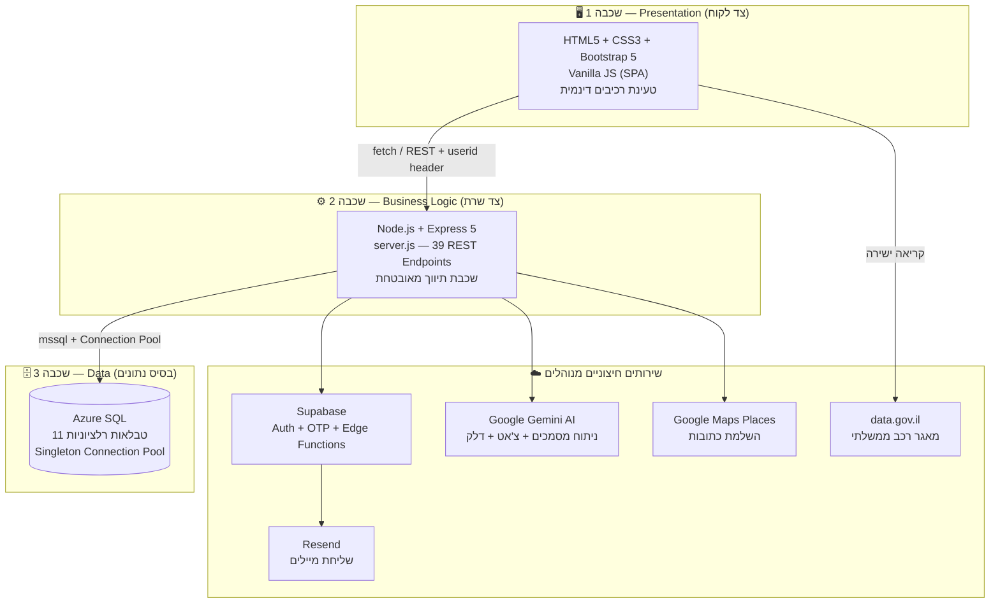
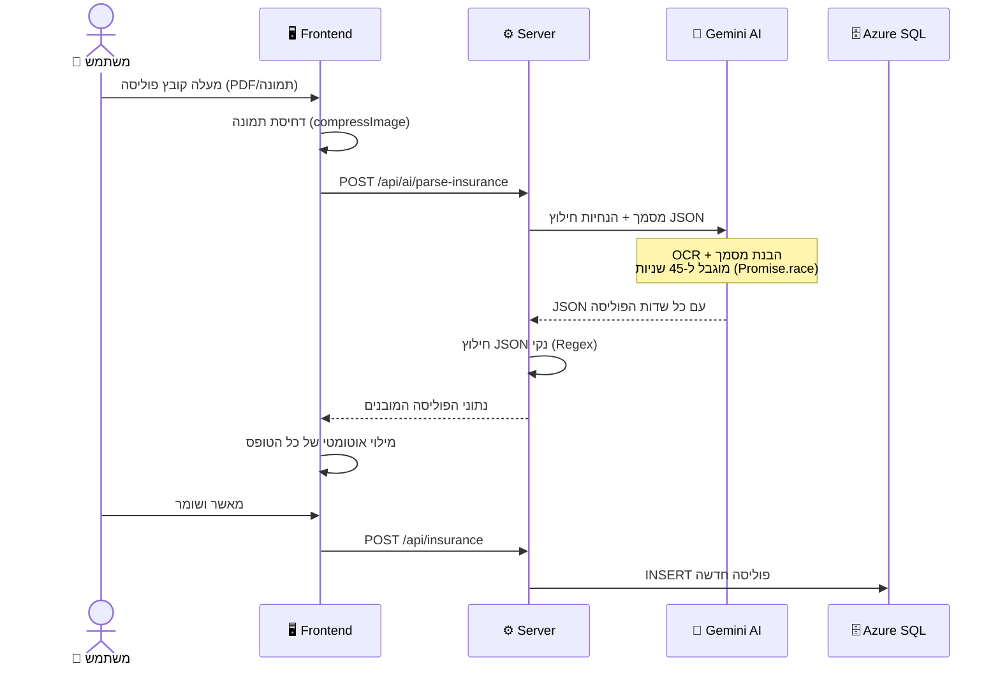
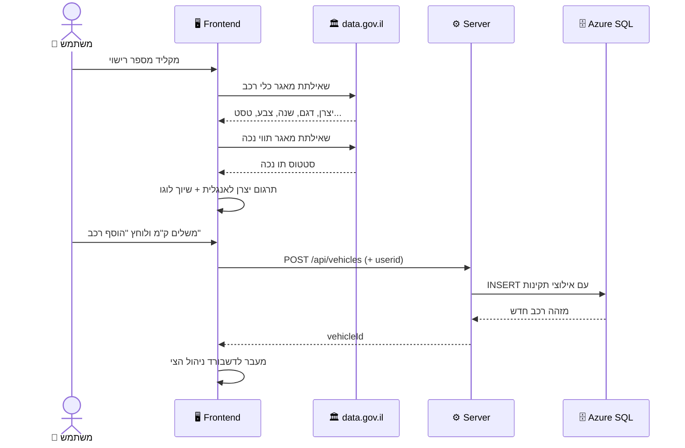
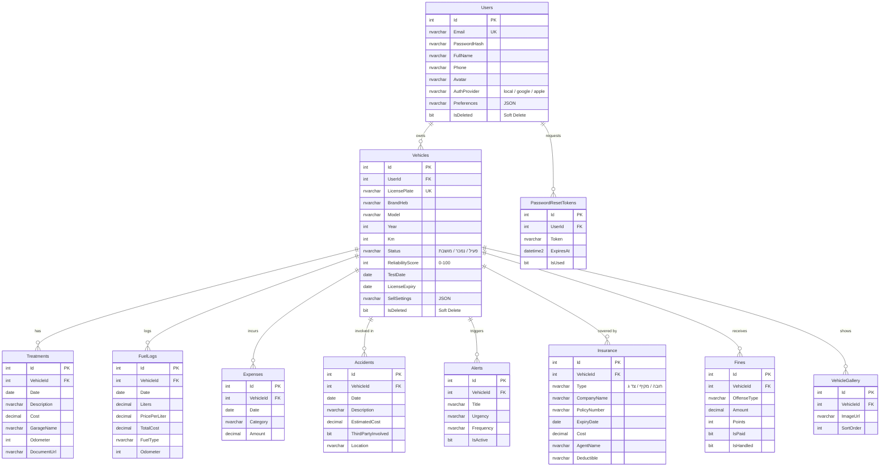

<div align="center">

# 🚗 EasyCare

### מערכת חכמה לניהול ותחזוקת רכבים מבוססת בינה מלאכותית


**פרויקט גמר** &middot; מיכאל גייאשס & רזיאל ביטון

*כל היסטוריית הרכב שלך — טיפולים, ביטוחים, דלק, דוחות ותאונות — במקום אחד, חכם ואוטומטי.*

</div>

<div dir="rtl" align="right">

## 📑 תוכן עניינים

- [⚠️ חשוב לפני שמתחילים — התחלה קרה (Cold Start)](#-חשוב-לפני-שמתחילים--התחלה-קרה-cold-start)
- [🎯 על הפרויקט](#-על-הפרויקט)
- [✨ יכולות מרכזיות](#-יכולות-מרכזיות)
- [🏛️ ארכיטקטורת המערכת](#%EF%B8%8F-ארכיטקטורת-המערכת)
- [🔄 תרשימי זרימה מרכזיים](#-תרשימי-זרימה-מרכזיים)
- [🗄️ מבנה בסיס הנתונים (ERD)](#%EF%B8%8F-מבנה-בסיס-הנתונים-erd)
- [🛠️ טכנולוגיות](#%EF%B8%8F-טכנולוגיות)
- [🗺️ מפת המסכים במערכת](#%EF%B8%8F-מפת-המסכים-במערכת)
- [📖 מדריך שימוש מלא](#-מדריך-שימוש-מלא)
- [💻 התקנה והרצה מקומית](#-התקנה-והרצה-מקומית)
- [🔐 משתני סביבה](#-משתני-סביבה)
- [🌐 תיעוד API מלא (39 Endpoints)](#-תיעוד-api-מלא-39-endpoints)
- [🧠 אלגוריתמים ולוגיקה חכמה](#-אלגוריתמים-ולוגיקה-חכמה)
- [📁 מבנה הפרויקט ומפת הקוד](#-מבנה-הפרויקט-ומפת-הקוד)
- [🎨 שפת העיצוב (Design System)](#-שפת-העיצוב-design-system)
- [⚡ ביצועים ואופטימיזציות](#-ביצועים-ואופטימיזציות)
- [🛡️ אבטחה](#%EF%B8%8F-אבטחה)
- [🧪 בדיקות ואבטחת איכות (QA)](#-בדיקות-ואבטחת-איכות-qa)
- [❓ פתרון תקלות נפוצות (FAQ)](#-פתרון-תקלות-נפוצות-faq)
- [🚀 חזון והמשך פיתוח (Roadmap)](#-חזון-והמשך-פיתוח-roadmap)
- [👥 קרדיטים](#-קרדיטים)

---

## ⚠️ חשוב לפני שמתחילים — התחלה קרה (Cold Start)

> [!IMPORTANT]
> הפרויקט רץ על **מסלולים חינמיים** של Render ו-Azure לצורכי הדגמה. יש לקחת בחשבון שתי התנהגויות בגישה הראשונה למערכת:

| רכיב | התנהגות | זמן המתנה | מה לעשות |
|---|---|---|---|
| 🖥️ **שרת Render** | נכבה אוטומטית לאחר ~15 דקות ללא פעילות | עד **50 שניות** בטעינה הראשונה | להמתין בסבלנות — העמוד ייטען מעצמו |
| 🗄️ **Azure SQL** | מסד הנתונים עובר למצב שינה (**Paused**) בחוסר פעילות | **60–90 שניות** בהתחברות הראשונה | אם לחיצה על "התחברות" לא מגיבה — להמתין כדקה **וללחוץ שוב** |

**מה קורה מאחורי הקלעים?** הבקשה הראשונה שלכם משמשת כ"פקודת התעוררות": היא מדליקה את שרת ה-Node.js ב-Render ושולחת אות התעוררות למסד הנתונים ב-Azure. ברגע ששניהם ערים — המערכת עובדת במהירות מלאה וללא כל עיכוב. ✅

> [!TIP]
> אם אתם מציגים את המערכת (למשל בהגנה על הפרויקט) — כנסו לאתר ובצעו התחברות **כ-5 דקות לפני** תחילת ההצגה. כך המערכת תהיה חמה ומהירה בדיוק כשתצטרכו אותה.

---

## 🎯 על הפרויקט

### הבעיה שבאנו לפתור

ניהול רכב פרטי בישראל דורש מעקב מתמיד אחרי עשרות פרטים במקביל: טיפולים תקופתיים, חידוש ביטוח חובה ומקיף, מועד הטסט הבא, אגרות רישוי, הוצאות דלק, דוחות תנועה ותיעוד תאונות. בפועל, רוב בעלי הרכב מנהלים את המידע הזה בצורה מבוזרת — קלסרים פיזיים, פתקים, הודעות ווטסאפ לעצמם, או פשוט בזיכרון.

התוצאה: קנסות על איחורי תשלום, ביטוחים שפגים בלי ששמנו לב, חשבוניות שהולכות לאיבוד — ובעיקר, **ירידת ערך משמעותית במכירת הרכב** בגלל היעדר תיעוד היסטורי רציף ומהימן שיכול לשכנע קונה.

### הפתרון — EasyCare

מערכת אחת שמרכזת את *כל* המידע על הרכב (Single Source of Truth), ומוסיפה שכבת בינה מלאכותית שעושה את העבודה השחורה במקומכם:

- 📸 **מצלמים פוליסת ביטוח** ← ה-AI קורא את המסמך וממלא את כל הטופס לבד
- 🔍 **מקלידים מספר רכב** ← כל הנתונים הרשמיים נשלפים אוטומטית ממאגרי משרד התחבורה
- 🧑‍🔧 **שואלים שאלה על הרכב** ← צ'אטבוט "מוסכניק וירטואלי" שמכיר את ההיסטוריה המלאה עונה תשובה אישית
- 💰 **רוצים למכור?** ← דוח מכירה ציבורי מקצועי עם קוד QR להדפסה נוצר בלחיצה אחת

### קהל היעד

| קהל | הצורך |
|---|---|
| 🚙 בעלי רכב פרטי | ניהול דיגיטלי מרוכז של כל מסמכי והוצאות הרכב |
| 👨‍👩‍👧‍👦 משפחות וארגונים קטנים | שליטה ובקרה על צי של מספר רכבים תחת חשבון אחד |
| 🤝 מוכרי רכבים | דוח שקיפות מקצועי ומהימן שמעלה את ערך הרכב בעסקה |

---

## ✨ יכולות מרכזיות

| יכולת | תיאור | טכנולוגיה |
|---|---|---|
| 🤖 **סריקת פוליסה ב-AI** | העלאת PDF או תמונה של פוליסת ביטוח — חילוץ אוטומטי של כל השדות ישירות לטופס | Gemini 2.5 Flash (OCR + JSON) |
| 🧑‍🔧 **מוסכניק וירטואלי** | צ'אטבוט חכם שמכיר את ההיסטוריה המלאה של הרכב הספציפי שלכם ועונה בהתאם | Gemini + RAG |
| 🚘 **שליפה ממשרד התחבורה** | הקלדת מספר רכב מביאה את כל הנתונים הרשמיים — כולל בדיקת תו נכה אוטומטית | data.gov.il API |
| ⛽ **מחירי דלק Live** | ווידג'ט עם מחיר הדלק הרשמי העדכני במדינה | Gemini + מטמון חכם (6 שעות) |
| 📊 **דשבורד פיננסי** | גרפים אינטראקטיביים של הוצאות לפי חודש, שנה וקטגוריה + תובנות AI אוטומטיות | Chart.js + Rule Engine |
| 🏆 **ציון אמינות רכב** | אלגוריתם משוקלל (0–100) שמדרג עד כמה הרכב מתוחזק ומתועד | Weighted Scoring |
| 📄 **דוח מכירה ציבורי** | עמוד אינטרנט ייעודי לרכב עם גלריה, היסטוריה מאומתת וקוד QR להדפסה לשמשה | Public Report + QR |
| 🖼️ **דחיסת תמונות חכמה** | כל תמונה שמועלית נדחסת אוטומטית בצד הלקוח לפני השליחה — חיסכון באחסון וברוחב פס | Canvas API (Client-Side) |
| 🔔 **התראות חכמות** | תזכורות לטסט, ביטוח וטיפולים עם רמות דחיפות ותדירויות | Alerts Engine |
| 💾 **שמירה אוטומטית** | כל שדה בטופס נשמר תוך כדי הקלדה — סגירת דפדפן בטעות לא מאבדת כלום | Auto-Save Drafts |
| 🔐 **התחברות מאובטחת** | הרשמה רגילה, Google, Apple + איפוס סיסמה עם קוד OTP למייל | Supabase Auth |
| 📬 **טופס צור קשר** | פניות נשלחות ישירות לתיבת התמיכה דרך פונקציית ענן | Supabase Edge Functions + Resend |

---

## 🏛️ ארכיטקטורת המערכת

המערכת בנויה בארכיטקטורת **3-Tier Monolith** ("Majestic Monolith") — שלוש שכבות ברורות עם הפרדת אחריות מלאה, בשילוב שירותים חיצוניים מנוהלים (Managed External Services):

</div>



<div dir="rtl" align="right">

### למה דווקא מונוליט ולא Microservices?

| שיקול | ההצדקה |
|---|---|
| 👥 **גודל הצוות** | לצוות של 2 מפתחים, מונוליט מבטל את תקורת התיאום בין שירותים נפרדים |
| 🐞 **דיבוג** | Stack Trace אחד רציף מהבקשה ועד ה-DB — במקום מעקב אחרי בקשות בין שירותים |
| 🚀 **פריסה** | `git push` אחד ← Render בונה ומעלה הכל. אין תזמורת של קונטיינרים |
| 💰 **עלות** | שרת אחד חינמי במקום ריבוי שירותים בתשלום |
| 📈 **מוכנות לעתיד** | ההפרדה הפנימית לשכבות מאפשרת פירוק עתידי לשירותים אם המערכת תגדל |

**זרימת CI/CD:** כל `git push` לענף הראשי ב-GitHub מפעיל אוטומטית בנייה ופריסה מחודשת ב-Render — אפס תצורה ידנית.

---

## 🔄 תרשימי זרימה מרכזיים

### זרימת סריקת פוליסת ביטוח ב-AI

</div>



### זרימת הוספת רכב חדש



<div dir="rtl" align="right">

---

## 🗄️ מבנה בסיס הנתונים (ERD)

בסיס הנתונים כולל **11 טבלאות** ב-Azure SQL. הישות המרכזית היא `Vehicles`, וכל טבלאות המשנה מקושרות אליה במפתח זר עם `CASCADE DELETE` — מחיקת רכב מוחקת אוטומטית את כל הרשומות התלויות בו:

</div>



<div dir="rtl" align="right">

### עקרונות בתכנון בסיס הנתונים

| עיקרון | מימוש | תועלת |
|---|---|---|
| **Soft Delete** | רכבים ומשתמשים מסומנים `IsDeleted = 1` במקום מחיקה פיזית | שחזור טעויות + שמירת היסטוריה |
| **אינדקסים ממוקדים** | `IX_Vehicles_UserId_Status`, `IX_Treatments_Vehicle_Date` ועוד | שאילתות מהירות גם בצמיחת נתונים |
| **אילוצי CHECK** | עלויות ≥ 0, סטטוסים חוקיים בלבד (`פעיל`/`נמכר`/`מושבת`) | שלמות נתונים גם אם השרת נעקף |
| **ייחודיות (UNIQUE)** | מייל משתמש, מספר רישוי | מניעת כפילויות במקור |
| **CASCADE DELETE** | כל טבלאות המשנה של רכב | אין רשומות יתומות במערכת |
| **ACID Transactions** | סנכרון רכב עוטף את כל הכתיבות בטרנזקציה אחת | "הכל או כלום" — אין מצב ביניים פגום |

---

## 🛠️ טכנולוגיות

| שכבה | טכנולוגיות | תפקיד |
|---|---|---|
| **Frontend** | HTML5, CSS3, Bootstrap 5, Vanilla JavaScript | ממשק SPA רספונסיבי בגישת Mobile-First |
| **גרפים** | Chart.js | ויזואליזציה פיננסית בדשבורד |
| **Backend** | Node.js, Express 5 | שרת API ולוגיקה עסקית |
| **Database** | Azure SQL Database + חבילת mssql | אחסון רלציוני עם Connection Pool |
| **Auth** | Supabase Auth | הרשמה, התחברות, OAuth, OTP |
| **AI** | Google Gemini 2.5 Flash | ניתוח מסמכים, צ'אטבוט, מחירי דלק |
| **Email** | Resend דרך Supabase Edge Functions | טופס צור קשר ומיילים תפעוליים |
| **נתוני ממשלה** | data.gov.il CKAN API | פרטי רכב רשמיים + תווי נכה |
| **מפות** | Google Maps Places API | השלמה אוטומטית של כתובות |
| **Hosting** | Render | אירוח בענן עם CI/CD אוטומטי מ-GitHub |

---

## 🗺️ מפת המסכים במערכת

המערכת כוללת **11 עמודים ראשיים** ו-**9 רכיבי דשבורד** הנטענים דינמית:

### עמודים ראשיים

| עמוד | קובץ | תפקיד |
|---|---|---|
| 🏠 דף הבית | `index.html` | עמוד נחיתה שיווקי עם הצגת יכולות המערכת |
| 🔑 התחברות | `login.html` | כניסה במייל/סיסמה, Google או Apple |
| 🔓 שחזור סיסמה | `forgot_password.html` | איפוס מאובטח עם קוד OTP למייל |
| 🚗 צי הרכבים | `after_login.html` | תצוגת כל רכבי המשתמש + ציוני אמינות |
| 🔍 חיפוש רכב | `search.html` | הקלדת מספר רישוי לשליפה ממשרד התחבורה |
| 📋 תוצאות חיפוש | `results.html` | הצגת הנתונים שנשלפו + הוספה לחשבון |
| 🎛️ דשבורד רכב | `dashboard.html` | מעטפת ה-SPA — טוענת את 9 רכיבי הניהול |
| 👤 פרופיל | `profile.html` | עריכת פרטים אישיים, אווטאר והעדפות |
| 📄 דוח ציבורי | `public_report.html` | עמוד מכירה פומבי לרכב (ללא התחברות) |
| 🔎 השוואת רכבים | `search_results.html` | סינון רב-ממדי לפי יצרן, דלק וצבע |
| 📬 צור קשר | `contact.html` | טופס פנייה ישירה לצוות התמיכה |

### רכיבי הדשבורד (נטענים דינמית לתוך `dashboard.html`)

| רכיב | קובץ HTML | קובץ JS |
|---|---|---|
| 🏠 סקירה כללית | `overview.html` | `dashboard-overview.js` |
| 🔧 טיפולים | `treatments.html` | `dashboard-treatments.js` |
| 🛡️ ביטוחים | `insurance.html` | `dashboard-insurance.js` |
| ⛽ תדלוקים | `fuel.html` | `dashboard-fuel.js` |
| 📋 דוחות וקנסות | `reports.html` | `dashboard-reports.js` |
| 💥 תאונות | `accidents.html` | `dashboard-accidents.js` |
| 💰 הוצאות | `expenses.html` | `dashboard-expenses.js` |
| 🔔 התראות | `alerts.html` | `dashboard-alerts.js` |
| 🏷️ השבחה למכירה | `sell.html` | `dashboard-sell.js` |

---

## 📖 מדריך שימוש מלא

### 1️⃣ הרשמה והתחברות

1. גלשו לעמוד הבית ולחצו **"הרשמה"** — או התחברו עם חשבון **Google / Apple** בלחיצה אחת
2. המערכת מזהה משתמש שנרשם ביותר מדרך אחת (למשל גם במייל וגם ב-Google) ומאחדת את החשבונות אוטומטית
3. שכחתם סיסמה? לחצו "שכחתי סיסמה" — קוד **OTP חד-פעמי** יישלח למייל לאיפוס מאובטח

> 💡 **תזכורת:** בכניסה ראשונה אחרי זמן ללא פעילות ייתכן עיכוב — ראו [הסבר על התחלה קרה](#%EF%B8%8F-חשוב-לפני-שמתחילים--התחלה-קרה-cold-start).

### 2️⃣ הוספת הרכב הראשון

1. לחצו **"הוסף רכב"** והקלידו את **מספר הרישוי** בלבד — זהו, זה כל מה שצריך
2. המערכת שולפת אוטומטית ממאגר משרד התחבורה: יצרן, דגם, שנת ייצור, צבע, סוג דלק (כולל זיהוי היברידי), מועד טסט אחרון (+ חישוב הטסט הבא), תוקף רישיון רכב, קבוצת זיהום ומידות צמיגים
3. המערכת אף בודקת אוטומטית אם לרכב יש **תו נכה** רשום במאגר הממשלתי ♿
4. השלימו קילומטראז' נוכחי ולחצו **"הוסף רכב 🚗"** — לוגו היצרן משויך אוטומטית

### 3️⃣ מסך צי הרכבים

לאחר ההתחברות תגיעו למסך המרכזי המציג את כל הרכבים שלכם ככרטיסיות, כל כרטיסייה עם:
**ציון אמינות** (0–100) מחושב בזמן אמת, סטטוס הרכב (פעיל / נמכר / מושבת), והתראות דחופות אם יש.

### 4️⃣ הדשבורד — מרכז השליטה של כל רכב

| אזור | מה רואים |
|---|---|
| 🏆 ציון אמינות | מדד 0–100 עם פירוט מה משפיע עליו ומה חסר לשיפורו |
| 📊 גרף הוצאות | השוואה חודשית/שנתית בחלוקה לקטגוריות (Chart.js) |
| ⛽ מחיר דלק Live | המחיר הרשמי העדכני — מתעדכן כל 6 שעות |
| 🔔 התראות קרובות | טסט, ביטוח וטיפולים — ממוינים לפי תאריך |
| 💡 תובנות AI | ניתוח אוטומטי: החודש היקר ביותר, קטגוריית ההוצאה המרכזית ועוד |

### 5️⃣ ניהול שוטף — תשעת המודולים

| מודול | מה עושים בו |
|---|---|
| 🔧 **טיפולים** | תיעוד טיפול: תאריך, תיאור, עלות, שם המוסך (עם השלמת כתובת אוטומטית), ק"מ + צילום חשבונית עם תצוגה מקדימה |
| 🛡️ **ביטוחים** | **הדרך הקלה:** לחצו "ייבוא אוטומטי ממסמך", העלו את הפוליסה — ה-AI ממלא את הכל. חיווי צבעוני לסטטוס תוקף |
| ⛽ **תדלוקים** | ליטרים, מחיר לליטר, סכום כולל, סוג דלק וק"מ — המערכת עוקבת אחרי צריכה לאורך זמן |
| 📋 **דוחות וקנסות** | תיעוד דוחות משטרה/חניה: סוג עבירה, סכום, נקודות, מועד אחרון לתשלום וסטטוס |
| 💥 **תאונות** | יומן תאונות עם עד 10 תמונות מהזירה, מיקום, פרטי צד ג' ועלויות משוערות מול בפועל |
| 💰 **הוצאות** | כל השאר: שטיפות, אביזרים, אגרות, חניה — בחלוקה לקטגוריות |
| 🔔 **התראות** | תזכורות מותאמות עם רמת דחיפות (גבוהה/בינונית/נמוכה) ותדירות חזרה |
| 🖼️ **גלריה** | תמונות הרכב עם סדר תצוגה — משמשות גם את דוח המכירה הציבורי |
| 🏷️ **השבחה למכירה** | הגדרת מה ייחשף בדוח הציבורי + הפקת קוד QR |

> 💾 **כל הטפסים במערכת נשמרים אוטומטית תוך כדי הקלדה.** נסגר הדפדפן? חזרו לטופס — הכל שם.

### 6️⃣ הצ'אטבוט — "המוסכניק הווירטואלי" 🧑‍🔧

פתחו את הצ'אט מכל מסך ושאלו בשפה חופשית:

> *"מתי הטיפול הבא שלי?"* &middot; *"כמה הוצאתי על דלק החודש?"* &middot; *"הרכב רועד בהילוך סרק — מה זה יכול להיות?"*

הצ'אטבוט מקבל את **כל ההיסטוריה של הרכב הספציפי שלכם** כהקשר (טכניקת RAG), ולכן התשובות אישיות ומבוססות על הנתונים האמיתיים — לא תשובות גנריות. השיחה נשמרת לאורך הביקור באתר.

### 7️⃣ מכירת הרכב — דוח ציבורי עם QR

1. גשו למודול **"השבחה למכירה"** וסמנו אילו נתונים לחשוף (למשל: להציג היסטוריית טיפולים, להסתיר עלויות)
2. המערכת מפיקה **עמוד אינטרנט ציבורי** ייעודי — עם גלריית התמונות, נתוני הרכב הרשמיים, היסטוריית הטיפולים ומדד האמינות
3. הדפיסו את **קוד ה-QR** והדביקו על שמשת הרכב — כל קונה פוטנציאלי סורק בטלפון ורואה דוח שקוף ומהימן
4. הדוח נגיש **ללא התחברות** — הקונה לא צריך חשבון במערכת

---

## 💻 התקנה והרצה מקומית

### דרישות מוקדמות

- **Node.js 18 ומעלה** — [הורדה](https://nodejs.org)
- חשבון **Azure SQL** עם הסכמה מותקנת (הקובץ `database_setup.sql` מצורף)
- חשבון **Supabase** (חינמי) עם Auth מופעל
- מפתחות API: **Google Gemini** ו-**Google Maps**

### שלבי התקנה

</div>

```bash
# 1. שכפול המאגר
git clone https://github.com/RazielBiton/Final_Project.git
cd Final_Project

# 2. התקנת תלויות
npm install

# 3. יצירת קובץ משתני סביבה
#    צרו קובץ .env בתיקיית השורש לפי הטבלה בהמשך

# 4. הקמת בסיס הנתונים
#    הריצו את database_setup.sql מול ה-Azure SQL שלכם
#    (דרך Azure Portal > Query Editor או SSMS)

# 5. הרצה
npm start
# השרת עולה על http://localhost:3000
```

<div dir="rtl" align="right">

---

## 🔐 משתני סביבה

צרו קובץ `.env` בתיקיית השורש עם המפתחות הבאים:

| משתנה | תיאור | איפה משיגים |
|---|---|---|
| `AZURE_SQL_CONNECTION_STRING` | מחרוזת התחברות מלאה ל-Azure SQL | Azure Portal ← SQL Database ← Connection Strings |
| `SUPABASE_URL` | כתובת פרויקט ה-Supabase | Supabase Dashboard ← Settings ← API |
| `SUPABASE_KEY` | מפתח anon/public | Supabase Dashboard ← Settings ← API |
| `GEMINI_API_KEY` | מפתח Google Gemini AI | [Google AI Studio](https://aistudio.google.com/apikey) |
| `GOOGLE_MAPS_API_KEY` | מפתח Places API להשלמת כתובות | Google Cloud Console |
| `PORT` | פורט השרת (ברירת מחדל: 3000) | אופציונלי |

> [!WARNING]
> **לעולם אל תעלו את קובץ `.env` ל-GitHub!** כל המפתחות חיים בצד השרת בלבד — הלקוח לעולם לא נחשף אליהם (השרת אף מגיש את מפתח המפות דרך endpoint ייעודי `/api/config/maps` במקום להטמיע אותו בקוד). בסביבת הענן, המשתנים מוגדרים דרך Render Dashboard ← Environment.

---

## 🌐 תיעוד API מלא (39 Endpoints)

כל ה-Endpoints מוגשים מ-`backend/server.js`. זיהוי המשתמש מתבצע באמצעות Header בשם `userid`.

### 🔑 אימות וניהול משתמש (10)

| Method | Endpoint | תיאור |
|---|---|---|
| `POST` | `/api/register` | רישום משתמש חדש מול Supabase |
| `POST` | `/api/login` | התחברות במייל וסיסמה |
| `POST` | `/api/auth/social-login` | התחברות Google/Apple עם איחוד חשבונות אוטומטי |
| `POST` | `/api/auth/send-otp` | שליחת קוד אימות חד-פעמי למייל |
| `POST` | `/api/auth/verify-otp` | אימות קוד + התחברות |
| `POST` | `/api/auth/verify-otp-only` | אימות קוד בלבד (לתהליך איפוס סיסמה) |
| `POST` | `/api/auth/reset-password-direct` | קביעת סיסמה חדשה לאחר אימות |
| `GET` | `/api/user/me` | שליפת פרופיל המשתמש הנוכחי |
| `POST` | `/api/user/update` | עדכון פרטים אישיים, אווטאר והעדפות |
| `GET` | `/api/config/supabase` | הגשת תצורת Supabase ללקוח בצורה מאובטחת |

### 🚗 רכבים (6)

| Method | Endpoint | תיאור |
|---|---|---|
| `GET` | `/api/vehicles` | כל רכבי המשתמש + נתוני משנה (שליפה מקבילית ⚡) |
| `GET` | `/api/vehicles/all` | שליפה רזה של רשימת הרכבים |
| `POST` | `/api/vehicles` | הוספת רכב חדש |
| `PUT` | `/api/vehicles/:id` | עדכון פרטי רכב |
| `DELETE` | `/api/vehicles/:id` | מחיקה רכה (Soft Delete) |
| `GET` | `/api/vehicles/sync/:id` | שליפת כלל נתוני הרכב לסנכרון מלא |

### 🔄 סנכרון (1)

| Method | Endpoint | תיאור |
|---|---|---|
| `POST` | `/api/vehicles/sync/:id` | סנכרון מלא של כל מודולי הרכב ב**טרנזקציית ACID אחת** |

### 📦 מודולי נתונים (16 — GET + POST לכל מודול)

| מודול | Endpoints |
|---|---|
| 🔧 טיפולים | `GET/POST /api/treatments/:vehicleId` |
| 🛡️ ביטוחים | `GET/POST /api/insurance/:vehicleId` |
| 📋 דוחות וקנסות | `GET/POST /api/fines/:vehicleId` |
| 💥 תאונות | `GET/POST /api/accidents/:vehicleId` |
| ⛽ תדלוקים | `GET/POST /api/fuellogs/:vehicleId` |
| 💰 הוצאות | `GET/POST /api/expenses/:vehicleId` |
| 🔔 התראות | `GET/POST /api/alerts/:vehicleId` |
| 🖼️ גלריה | `GET/POST /api/gallery/:vehicleId` |

### 🤖 בינה מלאכותית ושירותים (6)

| Method | Endpoint | תיאור |
|---|---|---|
| `POST` | `/api/ai/parse-insurance` | קבלת מסמך פוליסה ← JSON מלא של השדות (Gemini OCR) |
| `POST` | `/api/chat` | צ'אט מוסכניק וירטואלי עם הקשר הרכב (RAG) + Timeout של 45 שניות |
| `GET` | `/api/current-fuel-ai` | מחיר דלק עדכני עם מטמון חכם של 6 שעות |
| `POST` | `/api/contact` | שליחת פניית צור קשר לתיבת התמיכה |
| `GET` | `/api/config/maps` | הגשת מפתח Google Maps ללקוח בצורה מבוקרת |

---

## 🧠 אלגוריתמים ולוגיקה חכמה

הפרויקט כולל אלגוריתמים שפותחו בהתאמה אישית לצרכי המערכת:

### 🏆 ציון אמינות רכב — Weighted Scoring

**איפה:** `dashboard-overview.js`, `after_login.js`

ציון 0–100 המשוקלל משישה פרמטרים, כל אחד עם משקל שנקבע לפי חשיבותו לקונה פוטנציאלי:

| פרמטר | משקל |
|---|---|
| טיפולים מתועדים עם חשבונית | 30% |
| תדלוקים מתועדים | 20% |
| טסט בתוקף | 15% |
| קילומטראז' מעודכן | 15% |
| ביטוח חובה בתוקף | 10% |
| ביטוח מקיף/צד ג' בתוקף | 10% |

### ⚡ שליפה מקבילית — Promise.all

**איפה:** `server.js` ← `GET /api/vehicles`

כל 8 טבלאות המשנה של כל רכב נשלפות **במקביל** במקום בזו אחר זו — קיצור זמן תגובה של מאות מילישניות בכל בקשה.

### 🔒 טרנזקציית ACID — הכל או כלום

**איפה:** `server.js` ← `POST /api/vehicles/sync/:id`

סנכרון רכב עוטף את כל הכתיבות (טיפולים, ביטוחים, תדלוקים...) בטרנזקציה אחת. כשל באמצע ← Rollback מלא. אין מצב ביניים פגום.

### 💬 RAG — Retrieval-Augmented Generation

**איפה:** `chatbot.js` + `server.js` ← `POST /api/chat`

לפני כל פנייה ל-Gemini, ההיסטוריה המלאה של הרכב (טיפולים, תקלות, ק"מ) מוזרקת כהקשר של השיחה. התוצאה: תשובות מותאמות אישית במקום עצות גנריות.

### ⏱️ Timeout הגנתי — Promise.race

**איפה:** `server.js` ← כל קריאות ה-AI

כל קריאה ל-Gemini רצה במרוץ מול טיימר של 45 שניות. אם המודל לא ענה — המשתמש מקבל הודעה ידידותית במקום המתנה אינסופית.

### 📦 מטמון TTL מבוסס קובץ

**איפה:** `server.js` ← `GET /api/current-fuel-ai`

מחיר הדלק נשמר ב-`fuel_cache.json` עם חותמת זמן. כל עוד לא עברו 6 שעות — התשובה מוגשת מהמטמון ללא קריאת AI. חיסכון בעלויות ובזמן תגובה.

### 🖼️ דחיסת תמונות בצד הלקוח

**איפה:** `auth_utils.js` ← `compressImage()`

כל תמונה שמועלית (חשבונית, זירת תאונה, גלריה) מוקטנת ל-1200px מקסימום ונדחסת ל-JPEG באיכות 70% — **לפני** השליחה לשרת. חיסכון דרמטי באחסון וברוחב פס, בלי פגיעה מורגשת באיכות.

### 💾 שמירה אוטומטית — Auto-Save Drafts

**איפה:** `global-autosave.js`

כל שדה בכל טופס נשמר ב-`localStorage` תוך כדי הקלדה, עם מפתח ייחודי בתבנית `Draft_{עמוד}_{הקשר}_{שדה}`. סגירה בטעות ← הנתונים חוזרים אוטומטית בפתיחה הבאה.

### 🔄 איחוד חשבונות בהתחברות חברתית

**איפה:** `server.js` ← `POST /api/auth/social-login`

משתמש שנרשם גם במייל וגם דרך Google/Apple מזוהה לפי המייל ומאוחד לחשבון אחד לפי סדר עדיפויות חכם — ללא כפילויות במערכת.

### 🔍 סינון רב-ממדי — Set-Based Filtering

**איפה:** `search_results.js`

מסך השוואת הרכבים מנהל מצב סינון (יצרן, דלק, צבע) באמצעות אובייקטי `Set` — הוספה והסרה של פילטרים ב-O(1) וסינון משולב יעיל.

### 🗺️ מיפוי יצרנים דו-לשוני

**איפה:** `brand-map.js`

מילון תרגום מעברית לאנגלית של עשרות יצרני רכב ("סוזוקי" ← "suzuki") לשיוך אוטומטי של לוגו היצרן מתוך מאגר הלוגואים המקומי.

---

## 📁 מבנה הפרויקט ומפת הקוד

</div>

```text
Final_Project/
├── backend/
│   ├── server.js              # 🧠 לב המערכת — 39 REST Endpoints (1,646 שורות)
│   ├── db.js                  # 🔌 Singleton Connection Pool ל-Azure SQL (עד 50 חיבורים)
│   └── fuel_cache.json        # ⛽ מטמון מחירי דלק (נוצר אוטומטית)
│
├── frontend/
│   ├── index.html             # דף נחיתה
│   ├── login.html             # התחברות והרשמה
│   ├── forgot_password.html   # איפוס סיסמה עם OTP
│   ├── after_login.html       # מסך צי הרכבים
│   ├── search.html            # חיפוש רכב לפי מספר רישוי
│   ├── results.html           # תוצאות ממשרד התחבורה
│   ├── dashboard.html         # 🎛️ מעטפת ה-SPA
│   ├── profile.html           # פרופיל משתמש
│   ├── public_report.html     # 📄 דוח מכירה ציבורי
│   ├── search_results.html    # השוואת רכבים עם סינון
│   ├── contact.html           # צור קשר
│   │
│   ├── components/dashboard/  # 🧩 9 רכיבי SPA נטענים דינמית
│   │   ├── overview.html      #    סקירה, treatments.html, insurance.html,
│   │   └── ...                #    fuel, reports, accidents, expenses, alerts, sell
│   │
│   ├── js/                    # 25 מודולי JavaScript
│   │   ├── dashboard.js       # ליבת ה-SPA — ניתוב וטעינת רכיבים
│   │   ├── api.js             # אינטגרציה עם data.gov.il
│   │   ├── auth_utils.js      # Logout + דחיסת תמונות גלובלית
│   │   ├── brand-map.js       # מיפוי יצרנים עברית→אנגלית
│   │   ├── chatbot.js         # צ'אט מוסכניק וירטואלי (RAG)
│   │   ├── global-autosave.js # שמירה אוטומטית של טפסים
│   │   ├── public_report.js   # רינדור דוח המכירה הציבורי
│   │   ├── dashboard-*.js     # מודול JS לכל רכיב דשבורד (9 קבצים)
│   │   └── ...
│   │
│   ├── css/                   # עיצוב מותאם
│   └── images/logos/          # 🚗 מאגר לוגואים של יצרני רכב
│
├── database_setup.sql         # 🗄️ סכמת בסיס הנתונים המלאה
├── EasyCare_ERD.html          # 📊 תרשים ERD אינטראקטיבי להדפסה
├── package.json
└── README.md
```

<div dir="rtl" align="right">

---

## 🎨 שפת העיצוב (Design System)

המערכת מעוצבת לפי עקרונות **Modern Flat & Soft UI** בהשראת אפליקציות פיננסיות מתקדמות:

| רכיב עיצוב | מימוש |
|---|---|
| 📱 **Mobile-First** | כל מסך תוכנן קודם לטלפון ורק אז הורחב לדסקטופ — תאימות מלאה למסכי מגע |
| 🃏 **כרטיסיות מרחפות** | מידע בתוך כרטיסיות עם צלליות עדינות ופינות מעוגלות (Soft UI) |
| 🎨 **פלטת צבעים** | כחול עמוק (`#3b82f6`–`#2563eb`) לאמון ומקצועיות &middot; ירוק להצלחה &middot; אדום להתראות וקנסות &middot; כתום להמתנה |
| 👁️ **נוחות קריאה** | רקעי סלייט בהירים (`#f8fafc`) וטקסט כהה (`#334155`) למניעת עייפות עיניים |
| 🌐 **RTL מלא** | כל הממשק בנוי ימין-לשמאל באופן טבעי — לא תרגום מאולץ של ממשק לועזי |
| ⚡ **חוויית SPA** | מעבר בין מודולים ללא רענון דף — תחושת אפליקציה, לא אתר |

---

## ⚡ ביצועים ואופטימיזציות

| אופטימיזציה | איפה | השפעה |
|---|---|---|
| **Connection Pool יחיד** | `db.js` | חיבור אחד ממוחזר (עד 50 במקביל) במקום פתיחת חיבור לכל בקשה — חיסכון של ~200ms לבקשה |
| **שליפות מקביליות** | `server.js` | Promise.all על 8 טבלאות משנה — פי 8 מהיר מגישה טורית |
| **מטמון דלק 6 שעות** | `server.js` | הפחתת ~99% מקריאות ה-AI למחירי דלק |
| **דחיסת תמונות בלקוח** | `auth_utils.js` | הקטנת תעבורה ואחסון בעשרות אחוזים לפני שהתמונה בכלל יוצאת מהדפדפן |
| **אינדקסים ממוקדי שאילתה** | `database_setup.sql` | שליפות מסוננות לפי משתמש/רכב/תאריך נשארות מהירות גם בגדילה |
| **טעינת רכיבים לפי דרישה** | `dashboard.js` | נטען רק ה-HTML של המודול הפעיל — לא כל הדשבורד מראש |

---

## 🛡️ אבטחה

| שכבת הגנה | מימוש |
|---|---|
| 🔑 **מפתחות בצד שרת בלבד** | מפתחות Gemini / Azure / Supabase לעולם לא מגיעים לדפדפן. אפילו מפתח המפות מוגש דרך endpoint מבוקר |
| 🔐 **Supabase Auth** | ניהול סיסמאות מוצפן, OAuth רשמי של Google/Apple, קודי OTP חד-פעמיים |
| 🎫 **טוקני איפוס ייעודיים** | חד-פעמיים (`IsUsed`), עם תפוגה (`ExpiresAt`), מנוהלים בטבלה נפרדת עם אינדקס ממוקד |
| 🏠 **הפרדת דיירים (Tenants)** | כל שאילתה מסוננת לפי `UserId` — משתמש לא יכול לגשת לרכב של אחר |
| 🗑️ **Soft Delete** | נתונים לא נמחקים פיזית — הגנה מפני טעויות ושמירת נתיב ביקורת |
| ✅ **אילוצי DB כקו הגנה אחרון** | CHECK + UNIQUE + FK מונעים נתונים פגומים גם אם קוד השרת נעקף |
| 🔒 **HTTPS מקצה לקצה** | Render מספק תעודת TLS אוטומטית לכל התעבורה |

---

## 🧪 בדיקות ואבטחת איכות (QA)

תהליך הבדיקות שבוצע לאורך הפיתוח:

- **בדיקות זרימה מלאות (E2E ידני)** — כל תרחיש משתמש נבדק מקצה לקצה: הרשמה ← הוספת רכב ← תיעוד ← הפקת דוח
- **בדיקות רספונסיביות** — כל מסך נבדק בדסקטופ, טאבלט ומובייל; תוקנו באגי אזורי מגע (Touch-zone shifts)
- **בדיקות CRUD** — לכל אחד מ-9 המודולים נבדקו יצירה, קריאה, עדכון ומחיקה מול ה-DB האמיתי
- **בדיקות קלט קיצון** — קבצים גדולים, מסמכים לא קריאים ל-AI, מספרי רכב שאינם במאגר הממשלתי
- **בדיקות עמידות** — התנהגות המערכת בזמן Cold Start, נפילת AI (Timeout), וניתוקי רשת
- **תיעוד JSDoc מלא** — כל פונקציה בקוד מתועדת בעברית עם פרמטרים, ערכי החזרה וחריגות

---

## ❓ פתרון תקלות נפוצות (FAQ)

<details>
<summary><b>לחצתי "התחברות" ושום דבר לא קורה</b></summary>

זו ההתחלה הקרה של Azure SQL (מסלול חינם). המתינו 60–90 שניות ולחצו שוב — הלחיצה הראשונה שלחה פקודת התעוררות ל-DB והוא מתעורר ברקע. אחרי ההתעוררות הכל עובד מהר.
</details>

<details>
<summary><b>האתר לא נטען בכלל / מסך לבן ארוך</b></summary>

שרת Render במסלול חינם נכבה אחרי חוסר פעילות. הטעינה הראשונה מעירה אותו — עד 50 שניות. רעננו את העמוד במידת הצורך.
</details>

<details>
<summary><b>סריקת הפוליסה ב-AI לא מחזירה תוצאה</b></summary>

ודאו שהקובץ ברור וקריא (PDF או תמונה חדה ומיושרת). קריאות AI מוגבלות ל-45 שניות — אם יש עומס על שרתי Gemini, נסו שוב בעוד רגע.
</details>

<details>
<summary><b>מספר הרכב לא נמצא בחיפוש</b></summary>

המערכת שולפת ממאגר data.gov.il הממשלתי. רכבים חדשים מאוד (שטרם עודכנו במאגר) או רכבים מיוחדים לעיתים אינם מופיעים במאגר הציבורי.
</details>

<details>
<summary><b>מילאתי טופס והדפדפן נסגר — המידע אבד?</b></summary>

לא! מנגנון השמירה האוטומטית שומר כל שדה תוך כדי הקלדה. פתחו שוב את אותו טופס והנתונים יחזרו אוטומטית.
</details>

<details>
<summary><b>מחיר הדלק בווידג'ט לא מתעדכן</b></summary>

המחיר נשמר במטמון ל-6 שעות לחיסכון בקריאות AI. הוא יתרענן אוטומטית בתום התקופה — מחירי דלק ממילא מתעדכנים אחת לחודש.
</details>

<details>
<summary><b>העליתי תמונה גדולה והיא נראית מוקטנת</b></summary>

זו התנהגות מכוונת: המערכת דוחסת תמונות ל-1200px מקסימום לפני השמירה כדי לחסוך באחסון. האיכות נשמרת ברמה מצוינת לצפייה במסך.
</details>

<details>
<summary><b>נרשמתי במייל ואז התחברתי עם Google — יש לי שני חשבונות?</b></summary>

לא. המערכת מזהה לפי כתובת המייל ומאחדת את החשבונות אוטומטית — כל הרכבים והנתונים שלכם נשמרים בחשבון אחד.
</details>

---

## 🚀 חזון והמשך פיתוח (Roadmap)

רעיונות ותכניות להרחבה עתידית של המערכת:

- 📱 **אפליקציית מובייל native** (React Native / Flutter) עם התראות Push לתזכורות
- 🔔 **התראות אוטומטיות במייל/SMS** — תזכורת חכמה שבועיים לפני פקיעת טסט או ביטוח
- 📈 **חיזוי הוצאות מבוסס ML** — תחזית עלויות תחזוקה שנתית לפי דגם, גיל וק"מ
- 🧾 **סריקת חשבוניות מוסך ב-AI** — הרחבת מנוע ה-OCR מפוליסות גם לחשבוניות טיפול
- 🚗 **השוואת מחירי ביטוח** — אינטגרציה עם מחשבוני השוואה לקראת חידוש פוליסה
- 👨‍👩‍👧 **שיתוף רכב משפחתי** — מספר משתמשים מנהלים רכב אחד עם הרשאות שונות
- 🌍 **תמיכה רב-לשונית** — ממשק באנגלית וברוסית לצד העברית
- 📊 **ייצוא דוחות** — הפקת PDF/Excel של היסטוריית הרכב המלאה לרואה חשבון או לקונה

---

## 👥 קרדיטים

| | |
|---|---|
| 👨‍💻 **פיתוח** | מיכאל גייאשס & רזיאל ביטון |
| 🎓 **סוג הפרויקט** | פרויקט גמר (Final Project) |
| 📦 **מאגר קוד** | [github.com/RazielBiton/Final_Project](https://github.com/RazielBiton/Final_Project) |
| 📬 **תמיכה** | easycare.support@gmail.com |

</div>

<div align="center">

---

**EasyCare** — *כי לרכב שלך מגיע תיק רפואי דיגיטלי* 🚗✨

</div>
